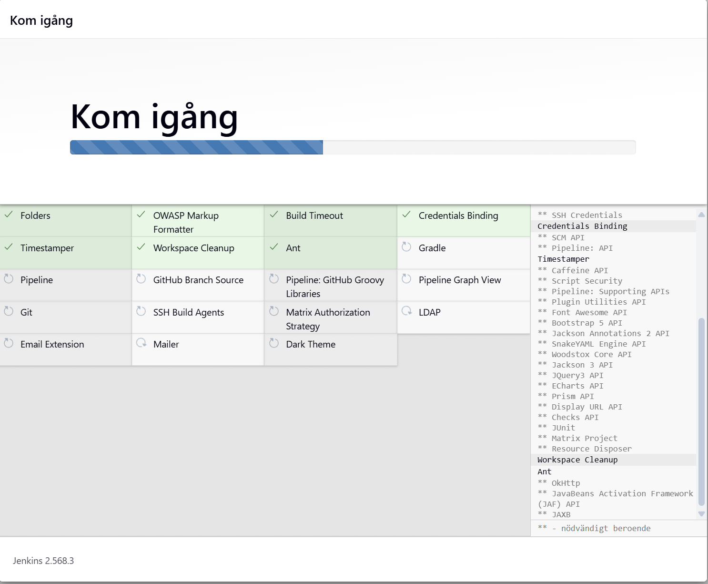
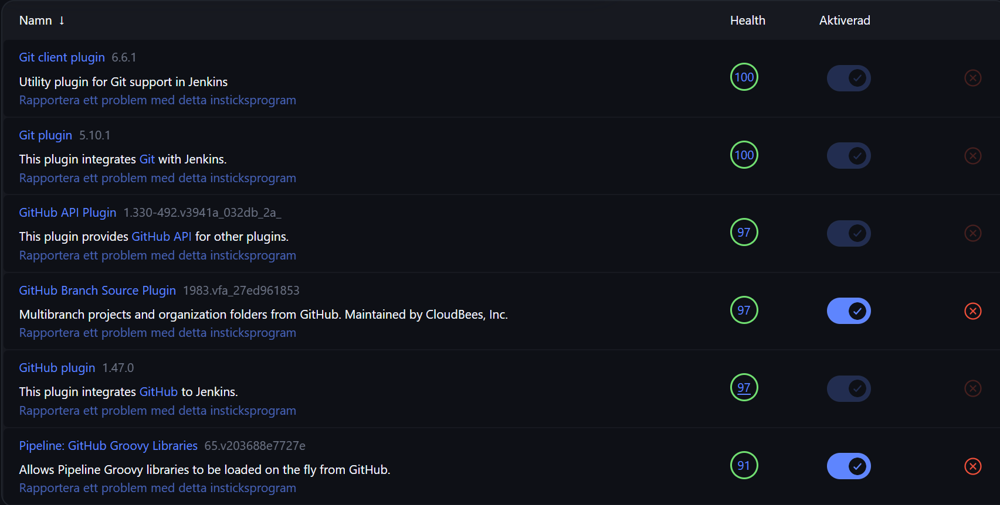
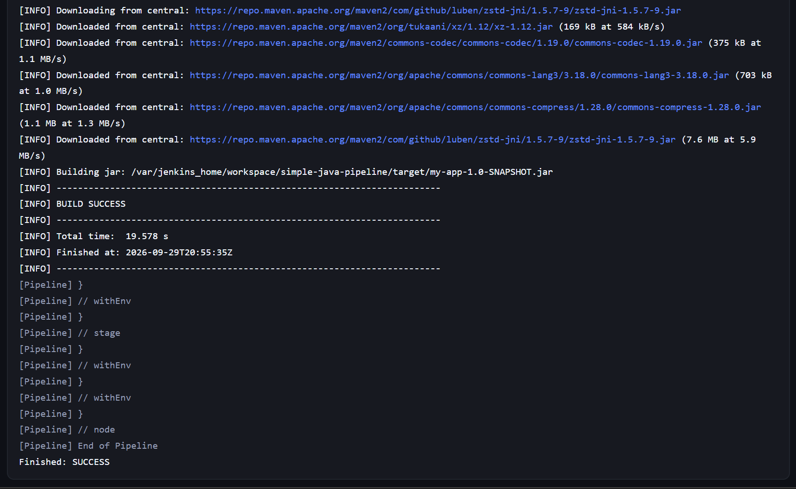
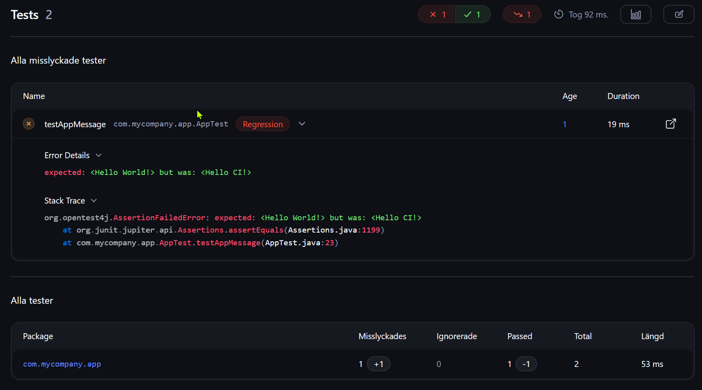
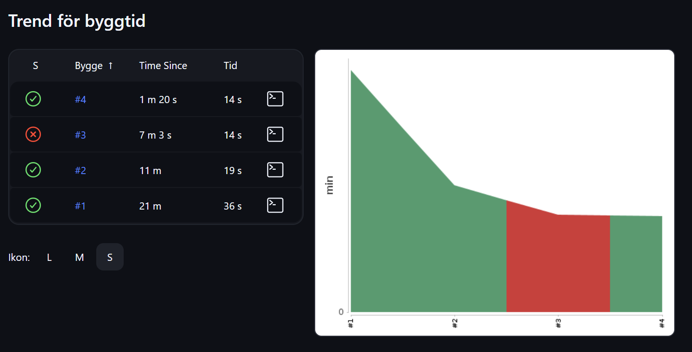
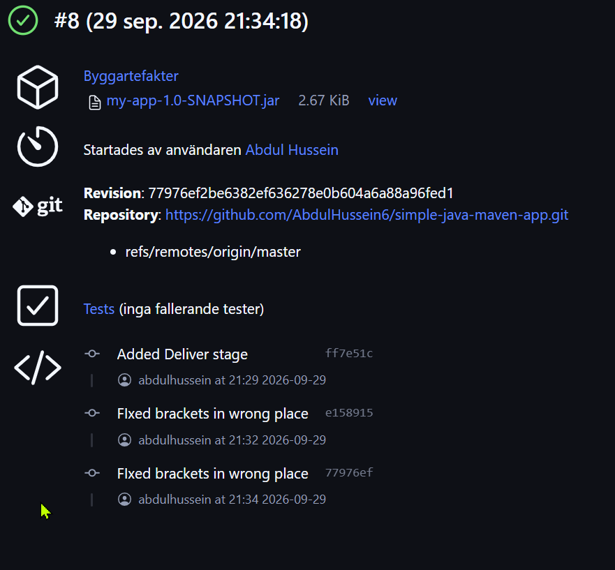
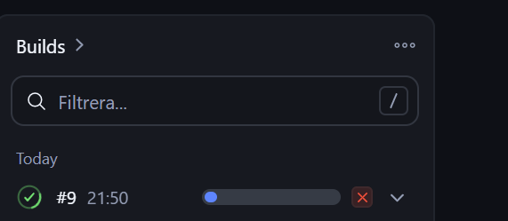

# CI/CD Pipeline with Jenkins and Maven

An automated CI/CD pipeline that builds, tests, and packages a Java application every time code is pushed to GitHub. Built with Jenkins (running in Docker) and Maven.

## Overview

Every push to this repository triggers Jenkins to:

1. **Build** the Java app with Maven
2. **Test** it by running the unit tests
3. **Deliver** it by running the deliver script and archiving the JAR

If any stage fails, the pipeline stops and the build turns red, so broken code is caught right away.

## Tools Used

- **Jenkins**: automation server that runs the pipeline
- **Maven**: builds, tests, and packages the Java app
- **Git and GitHub**: source control and the trigger for builds
- **Docker**: runs Jenkins in an isolated container

## How It Works

```
Git push -> Jenkins detects change (SCM polling) -> Build -> Test -> Deliver -> Archived JAR
```

## Setup

1. **Run Jenkins in Docker** and complete the setup wizard:
   ```bash
   docker run -d -p 8080:8080 -p 50000:50000 \
     -v jenkins_home:/var/jenkins_home \
     jenkins/jenkins:lts
   ```
2. **Configure Maven** in Jenkins as an auto-installed tool (Manage Jenkins -> Tools).
3. **Confirm the Git plugin** is installed.
4. **Fork and clone** the sample Java app from GitHub.
5. **Create a Pipeline job** using "Pipeline script from SCM", pointing to this repository.
6. **Enable Poll SCM** in the job's Triggers section with the schedule `* * * * *`.

## Jenkinsfile

The pipeline is defined as code in the `Jenkinsfile`:

```groovy
pipeline {
    agent any
    tools {
        maven 'Maven'
    }
    stages {
        stage('Build') {
            steps {
                sh 'mvn -B -DskipTests clean package'
            }
        }
        stage('Test') {
            steps {
                sh 'mvn test'
            }
        }
        stage('Deliver') {
            steps {
                sh './jenkins/scripts/deliver.sh'
                archiveArtifacts artifacts: 'target/*.jar'
            }
        }
    }
}
```

The `tools` block tells Jenkins to use the Maven installation configured in its tool settings, so no manual install is needed.

## What I Learned

- **CI/CD** automates the build-test-package cycle, so every change is checked the same way and bugs are caught early.
- A **Jenkinsfile** defines the pipeline as code, split into stages.
- A **failing unit test** turns the pipeline red. When a code change is intentional, the test has to be updated to match the new behavior.
- **SCM polling** lets Jenkins detect new pushes on its own, with no manual "Build Now."
- **Archiving the JAR** saves a ready-to-use artifact from every successful build.

## Testing the Pipeline

1. Change the code and its matching test.
2. Commit and push:
   ```bash
   git add .
   git commit -m "Update greeting and test"
   git push
   ```
3. Within about a minute, Jenkins starts a build automatically.
4. When all stages pass, download the JAR from the build page.

## Screenshots

### Jenkins setup: installing the suggested plugins


### Git and GitHub plugins installed and enabled


### Maven build succeeds and packages the JAR


### A failing unit test stops the pipeline
The test expected `Hello World!` but the code returned `Hello CI!`, so the Test stage failed and the build turned red.



### Build trend: broken build (#3) fixed in the next run (#4)


### Deliver stage archives the JAR


### SCM polling triggers a build automatically
After pushing a commit, Jenkins started build #9 on its own without clicking "Build Now."



## Next Steps

- Add a deploy stage that sends the JAR to the cloud (for example AWS)
- Provision infrastructure with Terraform
- Explore Kubernetes for running containers at scale

## Acknowledgments

Built as part of the [NextWork](https://nextwork.ai) project "CI/CD Pipeline with Jenkins and Maven".